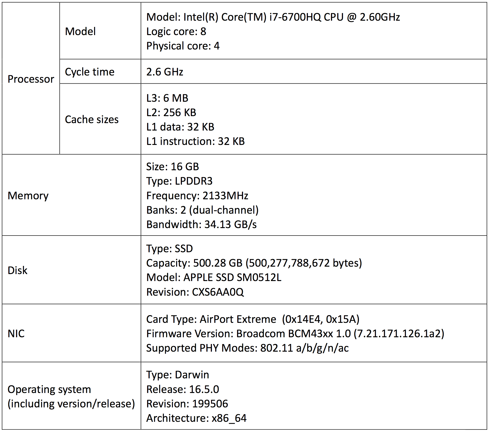
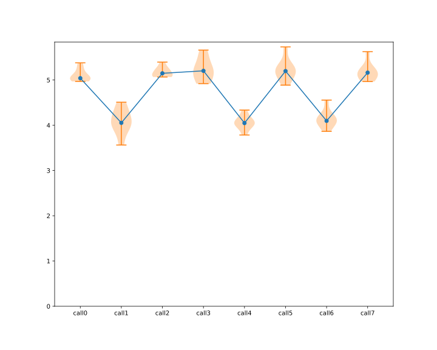
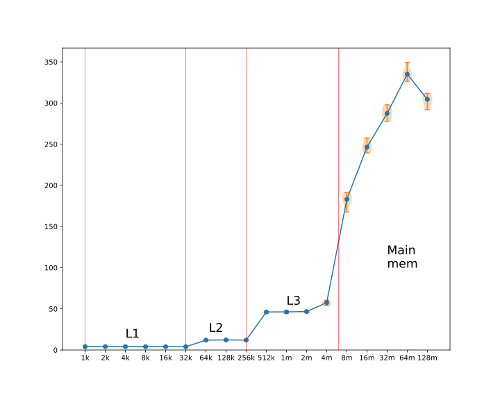
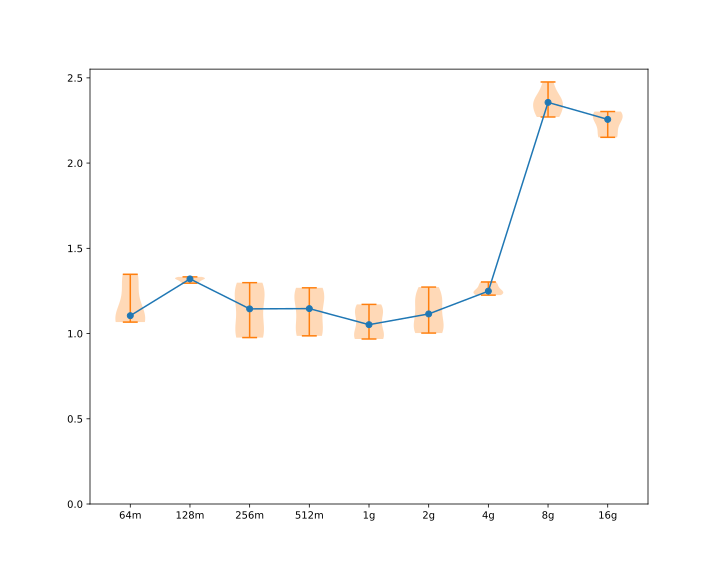
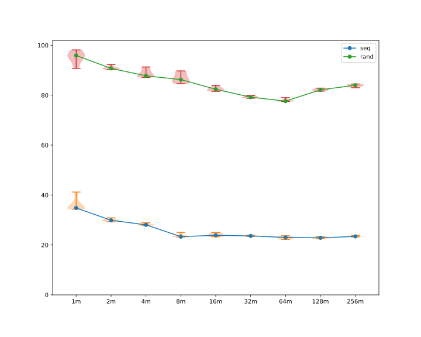
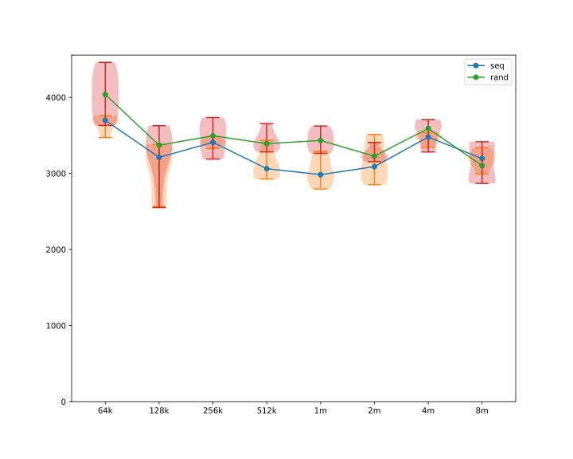
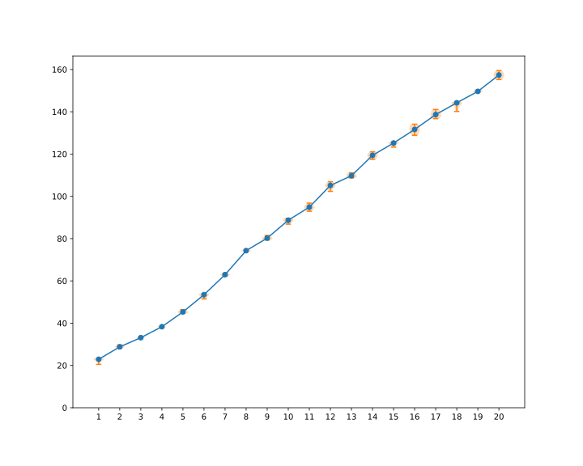

# CSE 221 Final Project

Dangyi Liu \<dangyi@ucsd.edu\>

Chenxi Zheng \<chz190@ucsd.edu\>

<style>
@media print {
  hr {

```
visibility: hidden;
page-break-after: always;
```

  }
  h1, h2 {

```
page-break-before: always;
```

  }
  h1:first-child, h2:first-child {

```
page-break-before: auto;
```

  }
}
</style>

## Introduction

### Objective

The objective of our project is to systematically determine the performance characteristic of the underlying hardware, such as CPU, RAM and disk, on a MacBook Pro (15-inch, Late 2016). Though there are substantial specifications and documentations about relative performance quantities online, many must be determined experimentally. Through this project, we will obtain a further understanding about the influence imposed by hardware performance on operating system and the relation between hardware performance and user’s subjective sense of application’s “responsiveness”.

### Methodology

All the experiments will be conducted on macOS by using C programming language with compiler Apple LLVM version 8.1.0 (clang-802.0.42). We set optimization setting of –O2 to eliminate the useless code, like function prologue / epilogue and unnecessary memory access. Since our tested CPU supports turbo boost, which results in a variable frequency, we must disable this feature when conducting all the measurements. 

Throughout the whole experiments, we use `rdtsc` instruction to count the number of cycles of CPU. Since the time cost of the most operations which we are going to measure is transitory, we then amplify the measured time by repeatedly executing the same operation for many times. Actually, this will also demonstrate better results because loop has a much better locality and greatly reduces the memory visit cost. 

In order to eliminate the software overhead, we are about to use the following method. To measure the running time of 1000 times of some operations, we first execute that operation 1000 times, get an executing time `t1`,and then executing it 2000 times to get an executing time `t2`. In the end, we calculate `t2 - t1` to be the final executing time, which approximately eliminates all software overhead. 

Also, in order to reduce other possible influences and obtain much more accurate results, we conduct 10 times of experiments for all measurements and analyze the median values.

## Machine Description




## CPU

### Measurement Overhead

#### Methodology

For reading time overhead, we repeatedly read the tsc for 100 million times and calculate the
average running time. To read the tsc, we use inline assembly `rdtsc` and `rdtscp` together with `cpuid`  to get an accurate value. 

As for looping overhead, we measure the running time of an empty loop. Since we are using -O2 optimization, we then add an empty inline assembly in the body of the loop to prevent the empty loop from being optimized away. This will not generate anything but to preserve the loop. 

#### Prediction

For reading time, according to Intel's optimization manual[^opt], the throughput of RDTSC should be 13 cycles. The loop overhead could be 2 cycles, then the overall cost should be 15 cycles.

For overhead of loop operation, since there are only 2 instructions in the loop and the branch prediction is considered to be  accurate, the loop overhead should be under 2 cycles.

[^opt]: http://www.intel.com/content/www/us/en/architecture-and-technology/64-ia-32-architectures-optimization-manual.html

#### Results

|              | Prediction | Experiment Results                       |
| ------------ | ---------- | ---------------------------------------- |
| Reading time | 15 cycles  | median = 25.257 cycles, std = 0.405 cycles |
| Loop time    | 2 cycles   | median = 1.002 cycles, std = 0.005 cycles |

#### Discussion
##### Prediction vs Results

The `rdtsc` overhead is much larger than our expectation, but we notice that the serializing version of `rdtsc`, `rdtscp` has a throughput of 20 cycles, which is much closer to our result. An explanation is that adjacent `rdtsc` can affect each other. Since Intel does not provide the latency of `rdtsc`, throughput represents only the lower bound of the executing time.

What interests us most is the loop overhead: it is as low as 1.00 cycles. The assembly code is shown as below.

```
LBB1_2:
	incl  %eax
	jne   LBB1_2
```

Here, `%eax` stores the counter which is initialized as -10000000. According to the developer's manual from Intel[^dev], `inc` should take 1 cycle, which means there's nearly no overhead for the `jne` instruction. This is reasonable because if CPU predicts every `jne` branch correctly, the whole executing procedure will be like

```
incl %eax
incl %eax
incl %eax
...
```

In this way, the cost is exactly 1.00 cycle because every two instructions are data dependent and cannot be issued simultaneously.

[^dev]: https://software.intel.com/en-us/articles/intel-sdm

##### Evaluation of success
Our experiment can be considered as successful though there are some difference from our prediction. However, our measured results are quite reasonable which confirm the success of our methodology.


### Procedure call overhead

#### Methodology

In order to measure the procedure call overhead, we repeatedly call an empty function for 100 million times. To make the code simple, we utilize the variable arguments feature of C. Other things worth noticing are

1. We must use `__attribute__((noinline))` in order to prevent the compiler from inlining the function call.
2. We must add an empty assembly in the body of the function in order to prevent the compiler from optimizing the function call away.
3. There is a difference between x86 call convention and x64 call convention. Since we are using x64 system with clang, the first 6 arguments will be passed using registers rather than stack.

#### Prediction

The cost of the procedure call mainly consists of three parts.

1. Loop overhead, as described above, is 1 cycle.
2. Argument passing overhead. According to different number of arguments, it should be between 0-10 cycles.
3. Callee overhead. Even the function body is empty, it needs to set up the frame pointer. Since this part of memory is definitely in cache, it should take 3-5 cycles.
```
_func0:
    pushq	%rbp
    movq	%rsp, %rbp
    popq	%rbp
    retq
```

Thus we predict the procedure call overhead about 4-16 cycles, varying from the number of arguments. 

#### Results

| \# of args | Prediction | Experiment Results                       |
| ---------- | ---------- | ---------------------------------------- |
| 0          | 5          | median = 5.041 cycles, std = 0.982 cycles |
| 1          | 6          | median = 4.053 cycles, std = 0.394 cycles |
| 2          | 7          | median = 5.148 cycles, std = 0.888 cycles |
| 3          | 8          | median = 5.203 cycles, std = 0.398 cycles |
| 4          | 9          | median = 4.049 cycles, std = 0.224 cycles |
| 5          | 10         | median = 5.198 cycles, std = 1.399 cycles |
| 6          | 11         | median = 4.097 cycles, std = 0.270 cycles |
| 7          | 12         | median = 5.163 cycles, std = 0.328 cycles |



#### Discussion
##### Prediction vs Results
The experimental results above indicate that the number of arguments has almost no impact on the executing time. We can take a look at the assembly code.

```
LBB10_1:
	movl	$1, %esi
	movl	$2, %edx
	movl	$3, %ecx
	movl	$4, %r8d
	xorl	%eax, %eax
	callq	_func
	decl	%ebx
	jne	LBB10_1

_func:
	pushq	%rbp
	movq	%rsp, %rbp
	popq	%rbp
	retq
```

An explanation for this is that, the `mov` instructions above are independent from each other, thus can be issued simultaneously. Since the CPI of ALU operations is 0.25, and we have 4 ALU units (according to Intel's manual[^opt]). We can support up to 16 assignments in one cycle. So the number of arguments won't affect our running time. 

##### Evaluation of success
As we discussed above that procedure calls can be issued simultaneously, thereby our measured results are still reasonable though they are not exactly what we predict. Therefore, we can say that our method to calculate procedure overhead is successful.


### System call overhead

#### Methodology

In order to measure the system call overhead, we use the simplest system call: `getpid` or `getuid`, since they are just read operations on PCB. We measure the cost of 100 million such calls, and calculate the median.

#### Prediction

System call requires a transition from user space to kernel space and then back to user space. Although we have fast system call, this action is not trivial since we need to change the CS and SS registers, involving a lot of memory accesses. Therefore, we predict the cost of system call between 100-300 cycles.

#### Results

| System call | Prediction | Results                                  |
| ----------- | ---------- | ---------------------------------------- |
| getpid()    | 300 cycles | median = 6.063 cycles, std = 1.014 cycles |
| getuid()    | 300 cycles | median = 411.065 cycles, std = 10.664 cycles |
| getppid()   | 300 cycles | median = 412.079 cycles, std = 71.808 cycles |

#### Discussion

##### Prediction vs Results

From the table above, we can see a huge difference between `getpid` and `getuid`. As a matter of fact, `getpid` caches the result while a process's pid will not be changed once determined. Measured results of `getuid` and `getppid` are much closer to our prediction.

##### Evaluation of success

Our methodology is still considered to be successful since the results of `getuid` and `getppid` are reasonable, and the result of `getpid` can be explained by existence of cache.


### Task creation time

#### Methodology

For process creation, we use the `fork` system call to create a new process. In the new process we simply call `exit`.

For thread creation, we use the `pthread_create` system call. Since thread execution is based on a function, we simply provide it with an empty function.

#### Prediction

Process creation should take quite a lot of time: it needs to allocate a PCB and sets up the page table. Therefore, the cost should be around 10000 cycles or more.

Thread is much lighter than process, thereby we predict the cost to be around 3000 cycles.

#### Results

|         | Prediction | Results                                  |
| ------- | ---------- | ---------------------------------------- |
| Process | 10000      | median = 892726.958 cycles, std = 568488.289 cycles |
| Thread  | 3000       | median = 23591.170 cycles, std = 5554.044 cycles |

#### Discussion

##### Prediction vs Results

Apparently we underestimate the cost greatly. It takes nearly 0.2 ms for OS to create a new process. A possible explanation is that the operation not only involves process creation, but also involves context switching. Creating thread is much faster than process, which means XNU kernel uses different structure to handle process and thread.

Another interesting observation is that, the creation cost of a thread is proportional to the number of threads being created, while for process, the cost remains to be a constant. This illustrates that in XNU kernel, threads are handled in a linear-time data structure such as linked list.

##### Evaluation of success

Our methodology is considered to be successful since we can see a huge increase of task creation time from thread to process. Although the results is larger than our prediction, there are some explanation for that and are presented in the discussion section above.

### Context switch time

#### Methodology

To measure the context switch time, we should first create one process / thread and then conduct CPU switches between the parent process / thread and child process / thread. To achieve this, we use pipes: first parent writes on the pipe and child reads, then the child writes on the pipe and the parent reads.

Another thing that worth noticing is that we need to disable the multicore feature of our CPU: otherwise it will be most likely that two processes / threads are running on different cores, thereby produces a much better result.

#### Prediction

Since context switch between processes will change the page table and clean the TLB which is time-consuming, we predict the cost to be around 10000 cycles.

The context switch between threads are considered to be quicker since they share the page table. We thus predict the cost to be around 5000 cycles.

#### Results

|         | Prediction   | Results                                  |
| ------- | ------------ | ---------------------------------------- |
| Process | 10000 cycles | median = 8823.152 cycles, std = 1345.508 cycles |
| Thread  | 5000 cycles  | median = 7897.956 cycles, std = 416.697 cycles |

#### Discussion

##### Prediction vs Results

The experiment result is quite close to our prediction, especially for the process part. Also, we can see that the context switch cost of thread is less than the cost of process which quite makes sense because the threads share resources together while processes are independent.

##### Evaluation of success
Our methodology can be considered as successful since we can see that context switch between processes is larger than between threads. 


## Memory

### RAM access time

#### Methodology

We use the same method put forward in Imbench paper to measure the latency for individual integer accesses to main memory, L1, L2 and L3 caches, namely the back-to-back-load latency measurement, in which we assume that the instructions before and after are both cache-missing loads. This method involves two parameters: array size and array stride. Array stride is the value increased by a list of pointers. In order to fulfill back-to-back-load latency, we set the stride as 4KB (32KB/8) with 8-way associativity. We conduct experiments on memory hierarchy as following possibilities: L1 hit, L2 hit, L3 hit and L3 miss. The algorithm of back-to-back-load latency can be represented as following pseudocode fragment.

```
p = head;
while (p -> p_next != NULL) {
  	p = p -> next;
}
```


#### Prediction

From Intel manual, we can see that capacity of L1 cache is 32KB with latency of 4 cycles; capacity of L2 cache of 256KB with latency of 12 cycles;  capacity of L3 cache of 6MB with latency of 44 cycles; capacity of main memory is  much larger than 6M, since there can be multiple possibilities for memory access involving TLB hit, TLB miss with L1 cache hit, TLB miss with L2 cache hit, TLB miss with L3 cache hit as well as TLB miss with L3 miss, we thus predict the latency to be between 100 and 300 cycles.

#### Results



|          | Prediction | Results                                  |
| -------- | ---------- | ---------------------------------------- |
| L1 cache | 4          | median = 4.013 cycles, std = 0.089 cycles |
| L2 cache | 12         | median = 12.047 cycles, std = 0.260 cycles |
| L3 cache | 44         | median = 46.283 cycles, std = 1.158 cycles |
| Memory   | 100-300    | median = 271.339 cycles, std = 93.885 cycles |

#### Discussion

##### Prediction vs Results

From the table and figure above, we can see that our experimental results match our prediction pretty well, especially when we compare the result of L1 cache and L2 cache with our prediction. Each cache level has its distinct latency value which increases along with the cache level increment and latency in main memory is obvious larger than in cache. Also, the latency varies little in the same cache level.

However, we can see an interesting phenomenon in main memory part, in which the change of latency does not linearly increase with the increment of array size and we can see 64MB array size generates more latency than 128MB. There must be some other influential factor behind that cause this uncommon phenomenon. 

##### Evaluation of success

Our methodology of measuring RAM access time is quite successful and we can see the results are consistent with our prediction. From the figure above we can see distinct latency between L1, L2, L3 cache as well as main memory. And the variance of latency in each cache level is trivial. Also, we can see in main memory, almost every time we increase the size of array, we can see a corresponding increase of latency. Therefore, we can say our methodology for measuring RAM access time is successful.

### RAM bandwidth

#### Methodology

There are many possibilities when accessing memory, such as CPU and memory bus. In order to avoid CPU from being the bottleneck, we should use the measurement which is exactly opposite from the method we used in measuring RAM access time. This time, we will maximize the parallelism of instruction execution, i.e. visit memory in a fixed pattern. Also, we conduct the experiments by write/read 64 bit per time rather than 32 bit.

We are going to measuring bandwidth of operations as follows:

1. read only by loop
2. write only by memset as well as loop
3. read and write by memcpy as well as loop

#### Prediction

We predict the result of read only and write only to be around 30 GB/s and 24 GB/s respectively since the designed bandwidth of hardware is 34.13 GB/s and read normally take less time than write. And read and write bandwidth should be half of this value, namely 15 GB/s.

#### Results

|                | Prediction | Results                                |
| -------------- | ---------- | -------------------------------------- |
| loop read      | 30 GB/s    | median = 15.122 GB/s, std = 2.183 GB/s |
| memset (write) | 30 GB/s    | median = 21.884 GB/s, std = 2.296 GB/s |
| loop write     | 30 GB/s    | median = 11.343 GB/s, std = 0.702 GB/s |
| loop rw        | 15 GB/s    | median = 8.401 GB/s, std = 0.569 GB/s  |
| memcpy (rw)    | 15 GB/s    | median = 8.560 GB/s, std = 1.090 GB/s  |

#### Discussion

##### Prediction vs Results

The results above are quite different from our prediction. A possible explanation is that we only access one memory bank during the whole experiment, while 34.13GB/s is the maximum throughput of two banks, we can only use half of it. Then we can see the results are mostly consistent with our prediction. When we use memset SIMD instruction, it will help reduce the CPU overhead as much as it can, thereby the result of memset (write) is much quicker than loop write and even better than loop read. When we conduct read and write together, the speed is smaller than either read or write along. We guess there can be some cost from switch of reads and writes and thus slow down the overall copy operation. We also calculate CPI for loop read/write, the value is around 2 which shows that the CPU overhead is not negligible.

##### Evaluation of Success

From discussion above, we think our method of measuring RAM bandwidth is still successful. Our result shows that loop reads are faster than loop write which makes sense. Also, the loop read/write and memcpy (rw) is comparably slower than read or write only which is also reasonable and we make some explanation for it in the discussion section above. Although the speed of memset (write) is quite fast and even better than loop read, it can be explained by the efficiency of memset SIMD instruction which reduce lots of CPU overhead. Also, our prediction is more about the best performance of memory frequency, the measured result is reasonable to be slower than our prediction.


### Page fault service time

#### Methodology

In this experiment, we will use `mmap` to map a big file into memory. For the sake of ensuring that every page faults, we visit memory page by page with a stride of 4KB.

#### Prediction

Our computer does not really run out of memory, so the mapped file is more likely to be in memory all the time. Thus, during this experiment we may possibly never reach our disk, so the cost is only a kernel trap which reads the data from file cache and sets up the page table. Therefore, we predict the cost of page fault procedure to be around 10000 cycles.

#### Results

|            | Prediction   | Results                                  |
| ---------- | ------------ | ---------------------------------------- |
| Page fault | 10000 cycles | median = 10,739.33 cycles, std = 108.13 cycles |

#### Discussion

##### Prediction vs Results

The page fault service time result above is quite close to our expectation, which confirms our assumption that our page fault handler never touches the disk. 

When we compared the page fault time with memory access time in previous section, we can see a huge different between them. The largest memory access time above is still under 350 cycles while measured result of page fault here reaches 10,739 cycles since page fault access disk and cost lots more time than accessing memory. 

##### Evaluation of Success

Since the measured result for page fault is close to our prediction and we can see a huge time increase from page fault and memory access time, we can say that our methodology is successful.


## Network

### Round trip time

#### Methodology

To measure the round trip time of a TCP connection, first we need to setup a TCP server. The logic of our TCP server is as follows: it listens to a special port and keeps accepting incoming connections. Once it accepts a connection, it echoes whatever it reads. The remote host is in charge of closing a connection.

With such TCP server, the round trip time is simply the time of a read and write operation. To ensure that the read and write operation only involves one round trip, the size of our message must be small enough to fit into one packet.

For loopback interface, we run the server in a background thread and connect to it from another thread. For remote interface, we run the server on another MacBook with the same hardware and software settings.

#### Prediction

From this part, we'll going to use ms as the time unit rather than cycle. Since both networking and disk are peripherals, whose speed is not related to the CPU frequency. The relation between ms and cycle is

$$ 1 \textrm{ ms} = 2,592,000 \textrm{ cycles} $$

Since everything is handled by the kernel during a local test, the cost should be fairly small. Considering the cost of a  system call is around 400 cycles and the cost of a context switch is 10,000 cycles, we predict the cost of a read and write operation on a loopback interface around 20,000 cycles, i.e., 0.01 ms.

According to [^latency guide], the typical round trip time in a data center is 0.5 ms.

[^latency guide]: [https://people.eecs.berkeley.edu/~rcs/research/interactive_latency.html](https://people.eecs.berkeley.edu/~rcs/research/interactive_latency.html)

#### Results

|                    | Prediction | Results                           | Measured ICMP                   |
| ------------------ | ---------- | --------------------------------- | ------------------------------- |
| Loopback interface | 0.01 ms    | median = 0.049 ms, std = 0.001 ms | mean = 0.067 ms, std = 0.002 ms |
| Remote interface   | 0.5 ms     | median = 3.254 ms, std = 0.271 ms | mean = 3.166 ms, std = 0.348 ms |

#### Discussion

##### Prediction vs Results

Loopback interface is purely about software overhead, while remote interface includes both software and hardware overhead. From the measured results above, we can see that the software overhead is quite trivial when compared with hardware overhead. Also, there is no huge difference between TCP and ICMP and ICMP is slightly smaller than TCP in remote interface because its request is directly handled at kernel level. 

When comparing our result with prediction, we can see that measured results of loopback interface is in the same magnitude of prediction. However, we seems to underestimate the cost in kernel which results in lower prediction value than measured results. As for remote interface, we can see that both results of TCP and ICMP are much higher than our prediction. That is because our prediction is based on Ethernet in data center while our experimental environment is wireless network which is much slower.

##### Evaluation of Success

We are successful in estimating both local and remote TCP and ICMP round-trip-time overhead. Although overhead of ICMP is slightly smaller than TCP rtt because their requests are handled at kernel level, hardware overhead for both of them are larger than software which supports our method to be successful.


### Peak bandwidth

#### Methodology

As opposite to the round trip time measurement, when measuring bandwidth, the size of a TCP packet should be as large as possible. In this experiment, we send 32 megabytes of data a time, which is much larger than the maximum size that one TCP packet can hold. We expect that this method will achieve the maximum bandwidth.

The software and hardware settings are the same as the above experiment.

#### Prediction

Since the loopback interface is implemented purely by the software. The bandwidth could be surprisingly high. Considering the memory R/W bandwidth we measured above (8 GB/s), and according to [^lbbd], we predict the bandwidth of the loopback interface to be 5 GB/s.

[^lbbd]: https://serverfault.com/questions/234223/how-fast-is-127-0-0-1

As for remote interface. Since the physical mode of our Wi-Fi network is 802.11n, the bandwdith won't surpass the data rate of 802.11n, which is typically 72 megabits per second[^802.11n]. Thus we predict the bandwidth of the remote interface to be 9 MB/s.

[^802.11n]: https://en.wikipedia.org/wiki/IEEE_802.11n-2009#Data_rates

#### Results

|                    | Prediction | Results                                 |
| ------------------ | ---------- | --------------------------------------- |
| Loopback interface | 5,000 MB/s | median = 3,485.9 MB/s, std = 119.6 MB/s |
| Remote interface   | 9 MB/s     | median = 4.760 MB/s, std = 0.572 MB/s   |


#### Discussion

##### Prediction vs Results

From the results above, we can see that the magnitude of our results accords with prediction. There can be interference between two laptops as well as electromagnetic interference from our surrounding environment which result in difference from our prediction. Also, we can see that software overhead here is significant and influences transmission speed a lot.

##### Evaluation of Success

Our method is at the same magnitude of our prediction and we conduct a quite good job in measuring both local and remote bandwidth. The result can be more close to prediction if the environmental interference decreases.


### Connection overhead

#### Methodology

We define setup time as the time required to open a connection to given host immediately before the first packet could be sent, i.e., the total time of `socket` and `connect` system calls.

The teardown time is defined as the time required so that we can perform the next setup operation, i.e., the time of `close` system call.

#### Prediction

Since we're using TCP, which is a stateful connection, setup could take 1 or 2 RTTs, depending on whether TCP fast open is enabled. Thus, we predict the local setup time to be 0.1 ms, and the remote setup time to be 10 ms.

The teardown cost of a TCP connection should be all software overhead, since the kernel could send the FIN packet asynchronously. We would predict both cost to be 0.05 ms.

#### Results

|                 | Prediction | Results                           |
| --------------- | ---------- | --------------------------------- |
| Local setup     | 0.1 ms     | median = 0.128 ms, std = 0.007 ms |
| Local teardown  | 0.05 ms    | median = 0.015 ms, std = 0.002 ms |
| Remote setup    | 6 ms       | median = 3.212 ms, std = 0.465 ms |
| Remote teardown | 0.05 ms    | median = 0.066 ms, std = 0.013 ms |


#### Discussion

From the result above we could see that we have get a quite close result with our predicted time. We have reached the result with a bigger overhead of setup compared with tear-down. The reason behind this is probably because we only measure the time spent for the close() system call. It is also the reason why the tear-down time did not vary a lot for local or remote mode.

Moreover it can be seen from the result that remote setup did cost way more overhead compared with local setup with the reason of the many layers of protection domains (equipment) the connection establishment need to cross.


##### Prediction vs Results

From table above, we can see that our results are close to our prediction except remote setup which is about half of our prediction. There can be two possible explanation for this. First, the smaller value of measured result of remote setup can be attributed to TCP fast open which lower the remote setup time to 1 round trip time since after receiving the second packet, the sender will send data directly. Second explanation is that as soon as the third packet is sent, the setup can be considered to be completed and that is why the whole TCP transmission time decreases to 1 RTT. 

We can also see a slightly larger value of remote teardown when compared with local teardown which may be caused by accessing NIC during remote teardown and induces more overhead.

##### Evaluation of Success

Since our results are quite close to our prediction and we propose some possible explanation of difference in remote setup, we can conclude that our methodology to be successful.


## File System

### Size of cache

#### Methodology

Since the file cache size is determined by the OS and will be sensitive to other load on the machine, it's impossible to measure the file cache of the kernel very accurately. In macOS, the kernel will use all available memory for the file system cache. Thus we must create and read from a file that is big enough to reach the limit of the operating system cache.

We'll create and access files whose sizes range from 64 MB to 16 GB, and read them block by block sequentially. The block size can be obtained using `diskutil info disk0s2` on macOS, which, in our case, is 4096 bytes.

#### Prediction

At the time of the experiment, the system has 6.85 GB memory that is either free or cached, which means that the available cache memory could be up to 6.85 GB. Based on this, we assume that file access under 6 GB will all hit the file cache, and file access above 6 GB will miss the file cache and read from the disk.

For file cache hit, the cost could be considered as reading a block of data from main memory. Based on the measurement of memory above, copying 4 KB data from kernel cache to user buffer costs `4 KB / 8 GB/s = 0.5 µs`. Considering the other overhead, we predict the read time of one block for files under 6 GB to be 1 µs.

For file cache miss, the more accurate way to predict is to look into the disk's speed. According to [^mpg], the read speed is over 3 GB/s. Thus, the prediction is about `4 KB / 3 GB/s = 1.33 µs`. Considering the other overhead, we predict the read time for files over 6 GB to be 2 µs.

[^mpg]: https://macperformanceguide.com/MacBookPro2016-SSD.html

#### Results



|                   | Prediction | Results                           |
| ----------------- | ---------- | --------------------------------- |
| fs_cache_seq_64m  | 1 µs       | median = 1.105 µs, std = 0.116 µs |
| fs_cache_seq_128m | 1 µs       | median = 1.321 µs, std = 0.013 µs |
| fs_cache_seq_256m | 1 µs       | median = 1.145 µs, std = 0.129 µs |
| fs_cache_seq_512m | 1 µs       | median = 1.146 µs, std = 0.115 µs |
| fs_cache_seq_1g   | 1 µs       | median = 1.052 µs, std = 0.082 µs |
| fs_cache_seq_2g   | 1 µs       | median = 1.115 µs, std = 0.100 µs |
| fs_cache_seq_4g   | 1 µs       | median = 1.249 µs, std = 0.028 µs |
| fs_cache_seq_8g   | 2 µs       | median = 2.356 µs, std = 0.069 µs |
| fs_cache_seq_16g  | 2 µs       | median = 2.256 µs, std = 0.061 µs |


#### Discussion

##### Prediction vs Results

From the graph above, we could see that our prediction is quite close to the real results.

For files under 6 GB, the average read time of a block is 1.1 µs. Although it doesn't reach the bandwidth limit of the memory (0.5 µs), the result is quite reasonable: we cannot always achieve the maximum bandwidth, especially when we're copying from kernel space to user space, when some security checks are performed. 

An interesting observation is that this bandwidth is very similar to the network bandwidth of the loopback interface we measured above: both are about 3.5 GB/s, which may mean that they have almost the same data path.

For files over 6 GB, our results shows that OS does a good job in exploiting the SSD performance. We can draw the conclusion that even though the file is too large to fit into the memory, parts of it are still cached. Otherwise, it's impossible to cold read a block from disk in 2 µs: the latency of a SSD is already more than 30 µs[^ssd_latency].

[^ssd_latency]: http://codecapsule.com/2014/02/12/coding-for-ssds-part-2-architecture-of-an-ssd-and-benchmarking/

##### Evaluation of Success

From the graph we can see that there's a huge gap between 4 GB and 8 GB, which is exactly what we predicted, since we could fit all 4 GB of file into memory but we cannot fit 8 GB or 16 GB. The different read time clearly shows the different speed in accessing memory and accessing disk. Thus, we could say that our methodology is quite successful.


### File read time

#### Methodology

In this part, we use basically the same methodology as we used in the previous part, i.e., read file sequentially / randomly block by block, with a block size of 4 kilobytes. Sequential read is straightforward. For random access, we use the following method: separate the file into two part and take turn to seek and read from one of them. The reason to use this method is to prevent reading from the same block twice.

To eliminate the effect of cache, we use the following methods:

1. For file cache, we use `fcntl` system call to set the `F_NOCACHE` flag to true. 
2. For disk cache, we run `purge` each time before we open a file for read.


#### Prediction

Since the disk we're testing is solid state, the size of file being read should roughly have no impact on the access time. Based on the assumption that cache is completely disabled, the time of reading a block from disk should be roughly equal to the latency reading the block, which, according to [^ssd_latency], is 50 µs (MLC). Considering the software overhead, we predict the time to be 75 µs.

These number should be the same for both sequential read and random read, since it's SSD and no cache is enabled. 

#### Results



| Size | Prediction | Results for sequential read        | Results for random read            |
| ---- | ---------- | ---------------------------------- | ---------------------------------- |
| 1m   | 75 µs      | median = 34.819 µs, std = 2.436 µs | median = 95.903 µs, std = 2.314 µs |
| 2m   | 75 µs      | median = 29.889 µs, std = 0.520 µs | median = 90.725 µs, std = 0.666 µs |
| 4m   | 75 µs      | median = 28.051 µs, std = 0.377 µs | median = 87.761 µs, std = 1.591 µs |
| 8m   | 75 µs      | median = 23.326 µs, std = 0.673 µs | median = 86.235 µs, std = 1.956 µs |
| 16m  | 75 µs      | median = 23.879 µs, std = 0.648 µs | median = 82.361 µs, std = 0.836 µs |
| 32m  | 75 µs      | median = 23.617 µs, std = 0.181 µs | median = 79.185 µs, std = 0.387 µs |
| 64m  | 75 µs      | median = 23.016 µs, std = 0.493 µs | median = 77.618 µs, std = 0.537 µs |
| 128m | 75 µs      | median = 22.851 µs, std = 0.320 µs | median = 82.158 µs, std = 0.391 µs |
| 256m | 75 µs      | median = 23.425 µs, std = 0.178 µs | median = 83.978 µs, std = 0.517 µs |


#### Discussion

##### Prediction vs Results

The results show that for random read the time is close to what we predicted, but for sequential read it's not. A potential explanation is that although SSD has a different structure from traditional disk, it still has a seek step when reading a block, which could benefit from locality. 

Another observation is that the read cost is larger than normal for small files. This could be because small files would spend relatively more time on reading metadata from disk after amortized, since they have less data blocks.

##### Evaluation of Success

As discussed above, our methodology is successful since the random read result matches the disk latency very much. However, we didn't foresee the effect of the locality in our sequential access and overestimate the cost of the sequential read. 


### Remote file read time

#### Methodology

We would adopt the same methodology as we did in the last part. Except the fact that the file is stored on a remote file system.

We choose AFP (Apple Filing Protocol) as the file sharing protocol, since it has a built-in support in macOS and does not have any client cache. The server is another MacBook with identical software and hardware settings. Before each measurement, we need to run `purge` on remote server.

Limited to the bad performance of our network, we remove files whose size is larger than 8 MB and add some small files whose size is less than 1 MB to improve the speed while still collecting enough data.

#### Prediction

Our network environment is slightly different from the above section, i.e.

1. The RTT between client and server is 2 ms, better than 3.5 ms above.
2. The maximum bandwidth is 8 MB/s, rather than 4.76 MB/s above.

Based on these, we could calculate that the time required to transfer one block (4 KB) is `4 KB / 8 MB/s = 0.5 ms` plus the RTT 2 ms, totally 2.5 ms, which is much larger than a local disk access. We could say that the time is dominated by the network cost. Thus we predict the time for both sequential read and random read to be 3 ms.

#### Results




| Size | Prediction | Results for sequential read       | Results for random read           |
| ---- | ---------- | --------------------------------- | --------------------------------- |
| 64k  | 3 ms       | median = 3.698 ms, std = 0.099 ms | median = 4.037 ms, std = 0.288 ms |
| 128k | 3 ms       | median = 3.211 ms, std = 0.319 ms | median = 3.371 ms, std = 0.348 ms |
| 256k | 3 ms       | median = 3.409 ms, std = 0.048 ms | median = 3.495 ms, std = 0.196 ms |
| 512k | 3 ms       | median = 3.062 ms, std = 0.180 ms | median = 3.392 ms, std = 0.124 ms |
| 1m   | 3 ms       | median = 2.984 ms, std = 0.175 ms | median = 3.433 ms, std = 0.124 ms |
| 2m   | 3 ms       | median = 3.089 ms, std = 0.252 ms | median = 3.227 ms, std = 0.080 ms |
| 4m   | 3 ms       | median = 3.479 ms, std = 0.065 ms | median = 3.592 ms, std = 0.166 ms |
| 8m   | 3 ms       | median = 3.195 ms, std = 0.109 ms | median = 3.102 ms, std = 0.245 ms |


#### Discussion

##### Prediction vs Results

The results matches our prediction roughly, except for some small files. The reason is the same as above: small files would spend relatively more time on reading and transferring metadata. We could also see that the time of random read is only slightly larger than sequential read, which proves our prediction.

Comparing the results of this experiment and the last experiment, we could draw the conclusion that network penalty is the dominant factor and takes over 95% of the time during a remote file access.

##### Evaluation of Success

Since the results matches our prediction well, we could conclude that our methodology is successful.


### Read contention

#### Methodology

To simulate the situation where multiple processes simultaneously perform the same operation on the same file, we take the following steps.

1. Purge the file system cache.
2. Create N threads.
3. In each thread
    1. Open the same file independently and set the `F_NOCACHE` flag.
    2. Read the content of the file until reaching end.
4. Main thread waits for all threads to end.
5. The total time for all threads to end divided by number of blocks read is our final result.

It's important to open the file independently in individual thread. Otherwise, file offset will be shared across different threads and causes unintended consequence.

#### Prediction

Since we're reading the same file from multiple threads, there would be a contention between those threads. Because the read request is served from the disk, and at a time only one thread could access the disk block. We predict the time be a linear function of the number of threads. 

#### Results




| # of thread | Prediction | Results                             |
| ----------- | ---------- | ----------------------------------- |
| 1           | 20 µs      | median = 22.924 µs, std = 0.955 µs  |
| 2           | 40 µs      | median = 28.806 µs, std = 0.466 µs  |
| 3           | 60 µs      | median = 33.154 µs, std = 0.138 µs  |
| 4           | 80 µs      | median = 38.326 µs, std = 0.114 µs  |
| 5           | 100 µs     | median = 45.320 µs, std = 0.604 µs  |
| 6           | 120 µs     | median = 53.474 µs, std = 0.917 µs  |
| 7           | 140 µs     | median = 62.949 µs, std = 0.408 µs  |
| 8           | 160 µs     | median = 74.299 µs, std = 0.333 µs  |
| 9           | 180 µs     | median = 80.234 µs, std = 0.688 µs  |
| 10          | 200 µs     | median = 88.698 µs, std = 0.905 µs  |
| 11          | 220 µs     | median = 94.884 µs, std = 1.188 µs  |
| 12          | 240 µs     | median = 105.150 µs, std = 1.370 µs |
| 13          | 260 µs     | median = 109.751 µs, std = 0.881 µs |
| 14          | 280 µs     | median = 119.366 µs, std = 1.234 µs |
| 15          | 300 µs     | median = 125.208 µs, std = 0.880 µs |
| 16          | 320 µs     | median = 131.631 µs, std = 1.746 µs |
| 17          | 340 µs     | median = 138.658 µs, std = 1.547 µs |
| 18          | 360 µs     | median = 144.247 µs, std = 1.601 µs |
| 19          | 380 µs     | median = 149.622 µs, std = 0.321 µs |
| 20          | 400 µs     | median = 157.378 µs, std = 1.444 µs |


#### Discussion

##### Prediction vs Results

Our prediction is partially right since the results show that time is a linear function of the number of threads. However, we didn't predict the slope correctly. The actual intercept is 12.6 µs and the slope is 7.4 µs. This could be because there's some caching mechanism when multiple threads visit the same file.

##### Evaluation of Success

We predict the linear relation between time and the number of threads correctly.


